# 🇧🇷 Olist E-Commerce Analytics: End-to-End Data Engineering & BI Project

   

## 📋 Executive Summary

This project demonstrates a complete **Analytics Engineering** workflow using the **Brazilian E-Commerce Public Dataset by Olist**. The goal was to transform 100k+ raw chaotic order records into a professional **Star Schema Data Warehouse**, followed by actionable business insights and advanced data science analytics.

The analysis reveals a platform with **7.5x revenue growth** but critical operational risks: a **96.88% one-time buyer rate**, extreme **seller concentration**, and severe **logistics bottlenecks** in Northern Brazil.

---

## 🏗️ Project Architecture

The project follows a modern **ELT (Extract, Load, Transform)** approach:
### **Modern ELT Pipeline Design**
```
Raw CSV Files → Staging Tables → Cleaned Tables → Data Warehouse → Semantic Views → Insights
     ↓                ↓               ↓                ↓                ↓            ↓
  Extract         Validate        Transform         Load           Consume      Analyze
```
1.  **Raw Layer:** Direct ingestion of CSV files (Orders, Customers, Payments, etc.).
2.  **Staging Layer (Cleaning):**
    * Aggregated 1M+ geolocation rows to unique zip code centroids.
    * Standardized timestamps and handled NULL category values.
3.  **Data Warehouse (The "Mart"):**
    * **Fact Tables:** `Fact_Orders`, `Fact_Order_Items` (Transactional grain).
    * **Dimension Tables:** `Dim_Customer`, `Dim_Products`, `Dim_Sellers`, `Dim_Geolocation`.
4.  **Semantic Layer:** Created `vw_order_metrics` to simplify complex joins for downstream analysts.
---

## 📊 Data Warehouse Schema

### **Fact Tables**
| Table | Grain | Purpose | Key Metrics |
|-------|-------|---------|-------------|
| `Fact_Orders` | Order-level | Core transaction analysis | Revenue, delivery time, status |
| `Fact_Order_Items` | Item-level | Product/seller analysis | Price, freight, product category |
| `Fact_Order_Financials` | Order-level | Financial reconciliation | GMV, payments, variance |
| `Fact_Reviews` | Order-level | Customer satisfaction | Review scores, sentiment |

### **Dimension Tables**
| Table | Key Attributes | Purpose |
|-------|---------------|---------|
| `Dim_Customer` | customer_id, unique_id, location | Customer segmentation, retention |
| `Dim_Products` | product_id, category, dimensions | Product performance, categorization |
| `Dim_Sellers` | seller_id, location, performance | Seller tiering, geographic analysis |
| `Dim_Geolocation` | zip_code, centroid, region | Spatial analysis, delivery optimization |
| `Dim_Date` | Date hierarchy | Time-based analysis |

### **Semantic Views**
- **`vw_order_metrics`**: Single source of truth for business analytics
- **`vw_seller_scorecard`**: Performance dashboard for seller management
- **`vw_customer_360`**: Complete customer view for CRM initiatives
---


## 📊 Key Business Insights & Visualizations

### 1. 📈 Revenue & Growth Trends

While the 7.5x revenue growth is impressive, the platform exhibits high structural fragility. The reliance on Black Friday (Nov 2017) indicates a "feast or famine" dependency on seasonal events rather than consistent organic growth.
Health & Beauty and Watches drive the business. These high-margin categories are the pillars of GMV.

| Sales Trend (Seasonality) | Top 10 Revenue Categories |
|:---:|:---:|
| 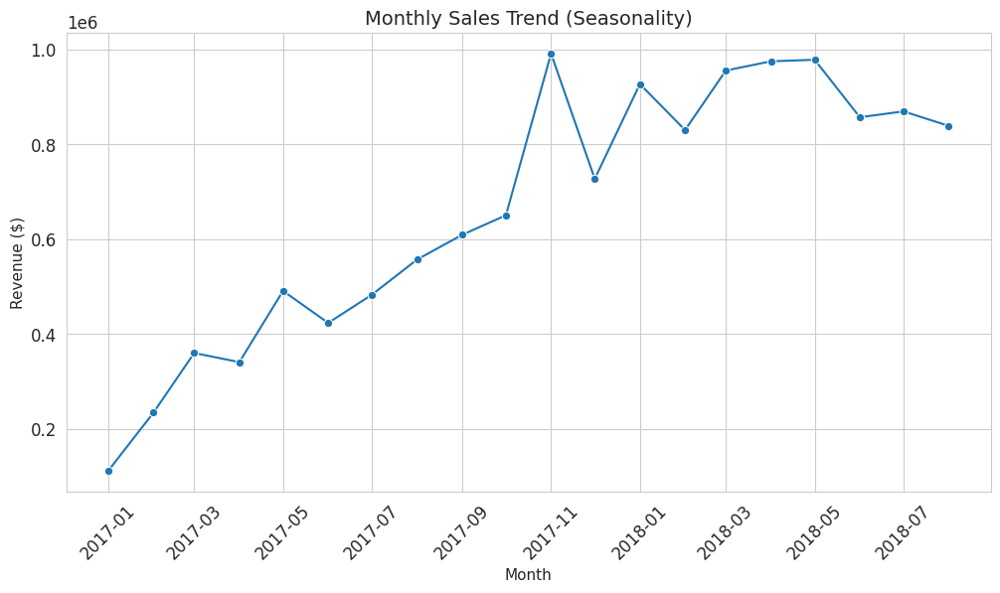 | 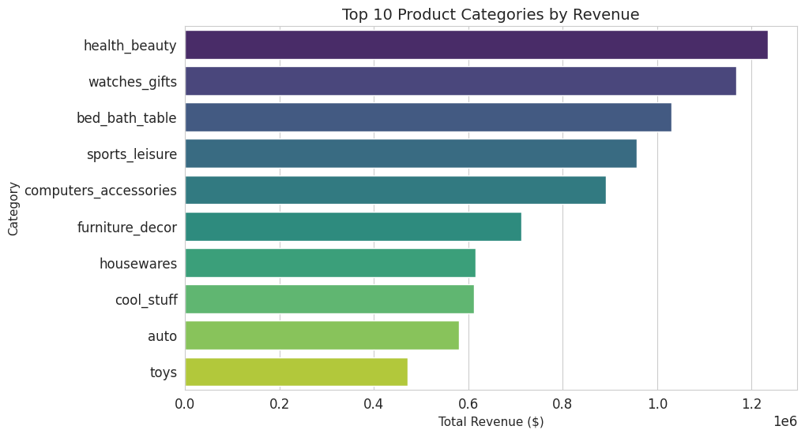 |

More alarmingly, the Pareto distribution is extreme. With the top 10% of sellers controlling 68% of GMV, Olist lacks leverage. If a competitor (e.g., Amazon Brazil, Mercado Libre) poaches just 50 of these "Power Sellers," Olist could lose half its revenue overnight. The platform is currently at the mercy of its top suppliers. 

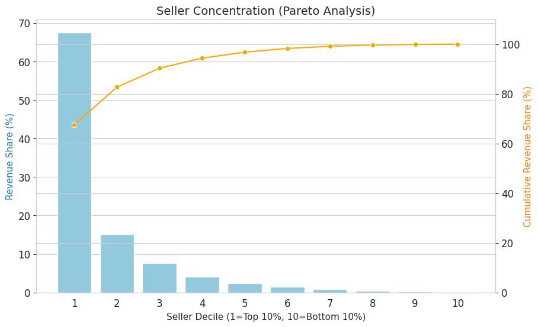

Strategic Implication: The immediate priority isn't acquiring more sellers, but locking in the top 10% with exclusive contracts or lower commission rates, while aggressively incubating mid-tier sellers to dilute this risk.
---

### 2. 🚚 Logistics & Operations
Logistics is not just a bottleneck; it is an existential threat to unit economics in specific segments.

The "Unprofitable" North: Delivering to Roraima (RR) takes 25+ days. In the age of Amazon Prime, this is unacceptable. Olist is likely burning support costs and brand equity on every Northern order. It may be more profitable to exit these regions until a fulfillment center is established.

The Electronics Margin Trap: With freight costs at 68.8% of the product price, the Electronics category is fundamentally broken. Customers are paying more for shipping than the item itself, which guarantees high cart abandonment.

| Logistics Breakdown (The Bottleneck) | Freight Cost Ratio |
|:---:|:---:|
| 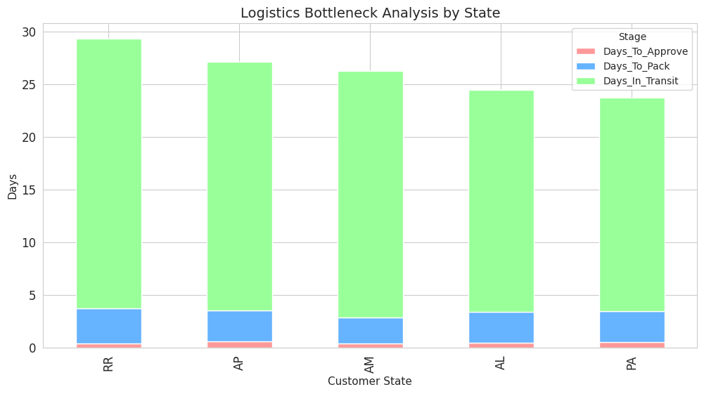 |  |

Operational Leakage: The 2,600+ orders in the "Operational Mess" table (shipped but lost, unavailable, canceled) represent direct revenue leakage. Specifically, the 1,107 orders "shipped but never delivered" suggest a massive gap in carrier accountability or theft, not just inefficiency.

<table> <tr> <td> 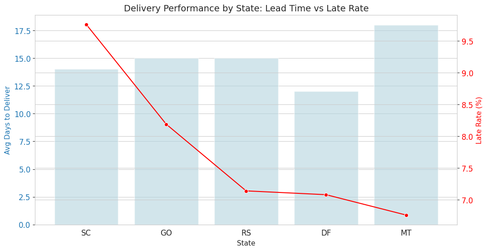 </td> <td> <table> <tr> <th>Order Status</th> <th>Count</th> </tr> <tr> <td>delivered</td> <td>96478</td> </tr> <tr> <td>shipped</td> <td>1107</td> </tr> <tr> <td>canceled</td> <td>625</td> </tr> <tr> <td>unavailable</td> <td>609</td> </tr> <tr> <td>invoiced</td> <td>314</td> </tr> <tr> <td>processing</td> <td>301</td> </tr> <tr> <td>created</td> <td>5</td> </tr> <tr> <td>approved</td> <td>2</td> </tr> </table> </td> </tr> </table>

---

### 3. 👥 Customer Behavior & Retention
 Olist is currently operating as a customer rental service, not a marketplace.

The 97% Churn Rate: A 96.88% one-time buyer rate means the Customer Lifetime Value (LTV) is essentially equal to the first transaction. This makes Customer Acquisition Cost (CAC) extremely hard to recover. The business model is bleeding cash on ads to bring in users who vanish immediately.


| Customer Retention Rate | Impact of Speed on Reviews |
|:---:|:---:|
| 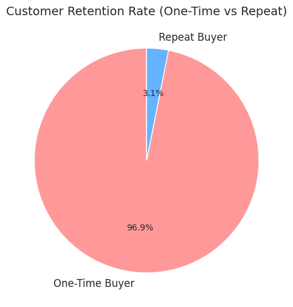 | 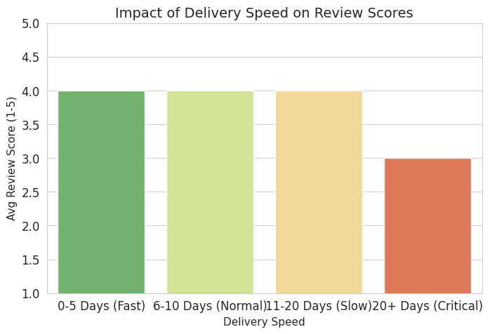 |

The "Professional" Pivot: The heatmap proves Olist is functionally a B2B marketplace. The volume collapses on weekends. Marketing spend is likely being wasted on "consumer" channels (Instagram/Facebook weekends) when it should be targeted at "Office Managers" and "Small Business Owners" on LinkedIn or Google Search during work hours.

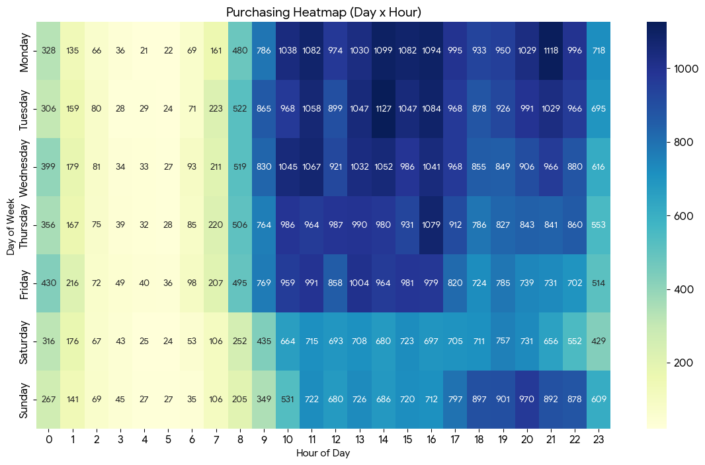

While Credit Cards dominate, the 20% Boleto share is a hidden inefficiency. Boletos have high friction (print -> pay -> wait for clearing). A 20% share likely correlates with inventory being locked up for days for orders that never convert (non-payment).

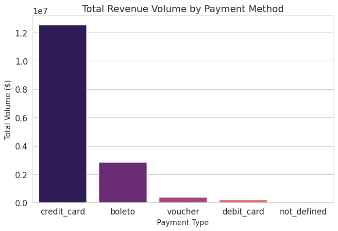

---

### 4. 🧠 Advanced Analytics (Strategic Opportunities)

The "Silent" Recommendation Engine:

The Sankey diagram reveals a massive missed opportunity. Even the strongest link (Bed/Bath -> Furniture) has only 128 bundles. In a dataset of 100k orders, this number is negligible.

Diagnosis: Product discovery is broken. Customers simply don't know Olist sells furniture when they buy sheets.

Opportunity: Implementing a basic "Frequently Bought Together" widget could likely increase Average Order Value (AOV) by 15-20% without acquiring a single new customer.


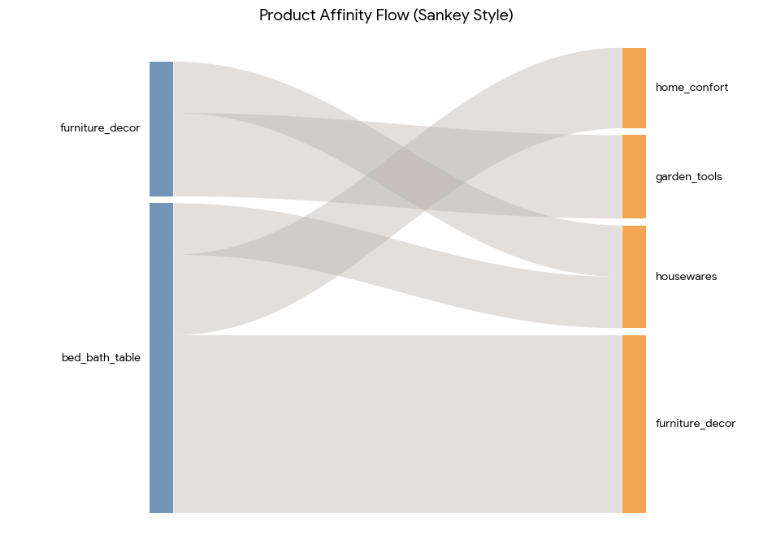

The "Revenue" Dilemma:

The Seller Matrix exposes a dangerous tolerance for bad actors. The Red Bars (High Volume / Low Rating) represent "Toxic Revenue."

Analysis: Olist is allowing these sellers to stay because they drive GMV (height of bar). However, these sellers are the root cause of the 3.0 Star Rating cliff and the 97% Churn Rate.

Decision: Keeping these sellers generates short-term cash but destroys long-term brand equity. They must be coached or banned.
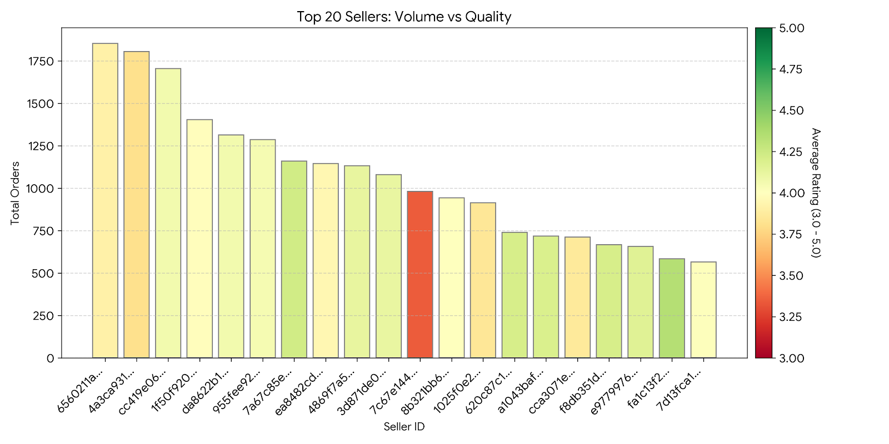

---

## 🎯 Strategic Recommendations

### **Immediate Actions (0-3 Months)**
1.  **Retention Loyalty Program:** Target the **96.88% one-time buyers** with "We Missed You" campaigns.
2.  **Northern Logistics Fix:** Stop standard shipping to **RR/AP** or set expectation to "30 Days". The current 25-day transit destroys NPS.
3.  **Seller Audit:** Immediately review the **High-Volume/Low-Rating sellers** identified in the Seller Matrix.

### **Long-Term Strategy (6-12 Months)**
1.  **Regional Fulfillment:** Open a distribution hub in the North to cut transit times from 25 days to <10 days.
2.  **B2B Focus:** Capitalize on the weekday buying behavior by launching "Olist for Business".
3.  **Bundle Deals:** Automate "Frequently Bought Together" for Bed/Bath + Furniture categories.
---
# 🛠 Technologies Used

* **Core Database:** Microsoft SQL Server (MSSQL)
* **ETL Pipeline:** Raw CSV ingestion $\rightarrow$ Staging Cleaning $\rightarrow$ Production Warehouse
* **Analytics Engineering:**
    * **T-SQL:** Complex Window Functions (`RANK`, `LEAD`), Common Table Expressions (CTEs), and Stored Procedures.
    * **Optimization:** Columnstore Indexes and Materialized Views for performance.
* **Data Modeling:** Dimensional Modeling (Kimball Methodology) creating Facts and Dimensions.
* **Visualization:** Python (Pandas for data wrangling, Seaborn/Matplotlib for heatmaps and plotting).
---

## 📂 Repository Structure

```text
├── Brazilian E-Commerce Public Datas              # Raw CSV files 
├── 📁 images/                                     # Generated visualizations
│   ├── logistics_bottlenecks.png
│   ├── purchasing_heatmap_annotated.png
│   ├── seller_concentration.png
│   ├── product_affinity.png
│   ├── retention_rate.png
│   ├── speed_vs_review.png
│   └── ... (All 13 visualizations)
├── 📁 sql_scripts/
│   ├── 01_Data_Cleaning.sql                        # Raw -> Staging transformations
│   ├── 02_Build_DWH.sql                            # Staging -> Fact/Dim Tables
│   └── 03_Business_Analysis.sql                    # Semantic View & 14 Business Queries
└── README.md                                       # Project Documentation
